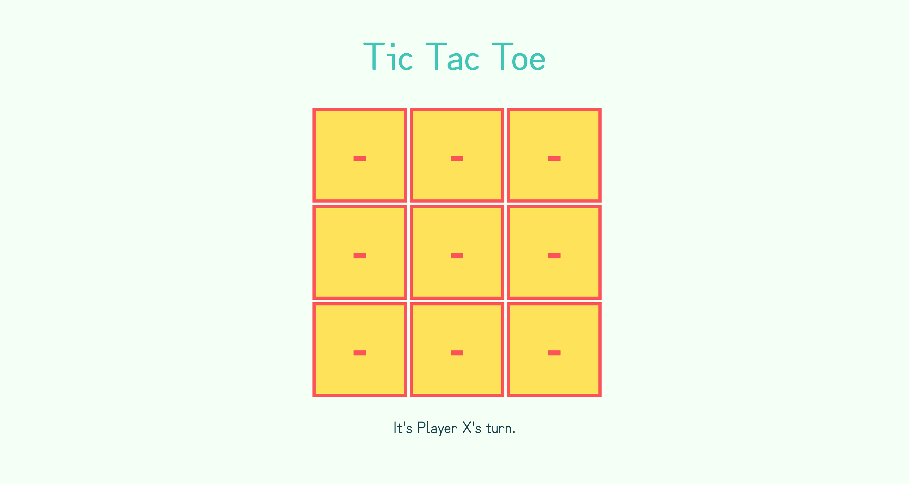
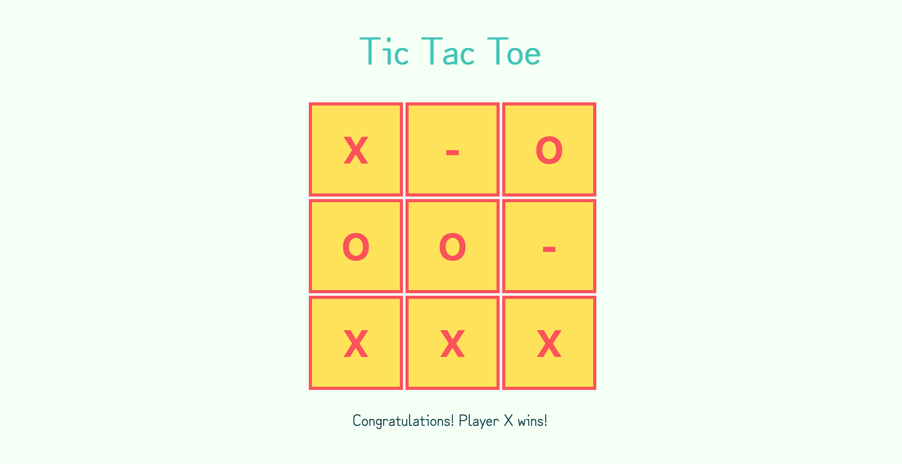

# dgmd-e-28-assignment-2

## Requirements

- [x] 3 X 3 Grid
- [x] Indicates whose turn it is
- [x] When the user clicks on a grid square (using buttons), places an X or O depending on whose turn it is
- [x] Checks for a "win" condition".
- [x] Congratulates the winner. The game is completed.
- [x] If all squares are occupied, announces it's a tie. The game is completed.
- [x] Only HTML, CSS, and JS are used.
- [x] JS loops used to build the grid.

## Screenshots

### Start of Game

### Example of End of Game

